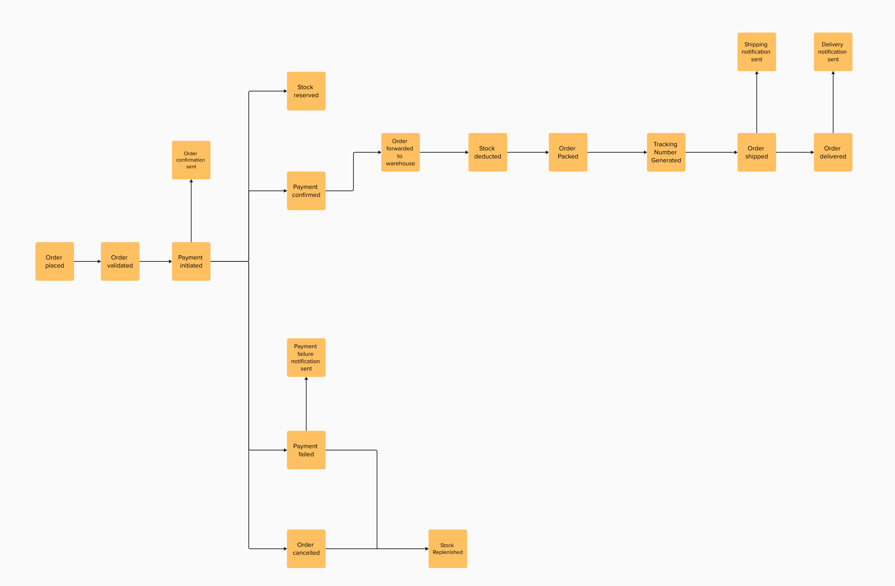
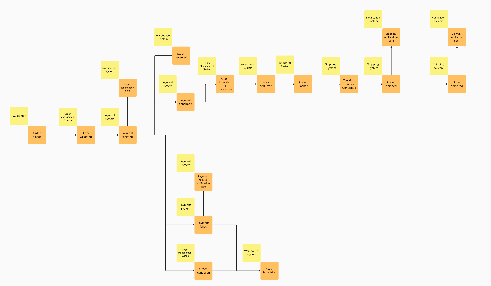
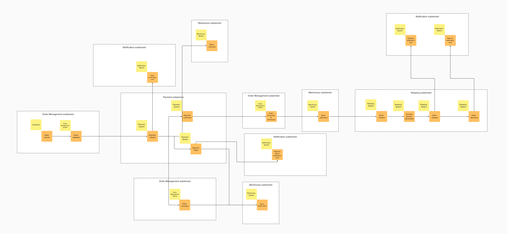

# Event Storming Process for E-commerce System

This document describes the iterative process of creating the Event Storming diagram for the e-commerce system. The process evolved through multiple stages, starting from identifying domain events and gradually refining the model by adding actors, subdomains, commands, and final adjustments.

---

## Step 1: Identifying Domain Events

The process began by identifying key **domain events**—significant occurrences in the business processes of the e-commerce system. These events were mapped out without considering their relationships or dependencies.

---

## Step 2: Adding Actors and Systems

In the second step, **actors** (e.g., customers, systems) that interact with or are affected by the domain events were added. This provided context for each event, showing who triggers or responds to them.

---

## Step 3: Defining Subdomains

To better organize the events and actors, **subdomains** were introduced. These subdomains represent logical groupings of related functionality within the system, such as Order Management, Payment, Warehouse, Shipping, and Notification.

---

## Step 4: Adding Commands

In this step, **commands** were introduced to represent actions that trigger domain events. Commands clarified the cause-and-effect relationships between user/system actions and resulting events.

---

## Step 5: Refining the Final Diagram

Finally, some domain events were reclassified as commands to better reflect their nature as actions rather than outcomes. The diagram was refined to ensure consistency and completeness. The final version represents a comprehensive view of the e-commerce system's processes.

---

## Summary of Steps

1. **Domain Events:** Identified key events in the system.
2. **Actors:** Added actors (e.g., Customer, Payment System) to provide context.
3. **Subdomains:** Organized events into logical subdomains.
4. **Commands:** Introduced commands to trigger domain events.
5. **Refinements:** Reclassified some events as commands and finalized the structure.

The final Event Storming diagram serves as a blueprint for understanding and designing the e-commerce system's architecture.
